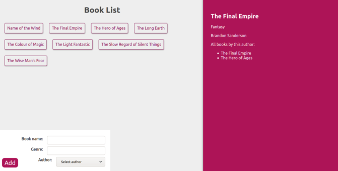

# MERN GraphQL Demo

A demo application for GraphQL (with Apollo) using the MERN Stack.
Implemented the frontend and backend.

[Live Site](https://merng-demo.herokuapp.com/)

## Overview

- View a list of books
- Click on book name to get details on book and author
- Add new book

[Live Site](https://merng-demo.herokuapp.com/)

## How to Run
To clone and run this application, you'll need [Git](https://git-scm.com) and [Node.js](https://nodejs.org/en/download/) (which comes with [npm](http://npmjs.com)) installed on your computer. From your command line:

```bash
# Clone this repository
$ git clone https://github.com/srikant-n/merng-graphql-demo.git

# Install dependencies
$ npm install

# Run the app
$ npm start

# Visit app on localhost:5000
```
